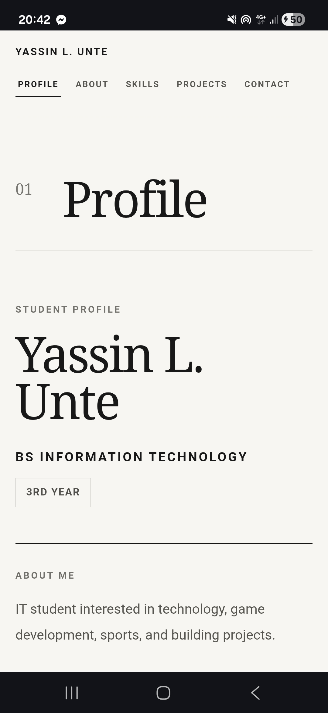
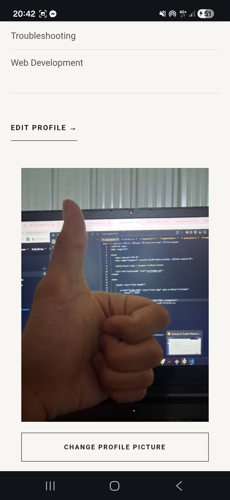
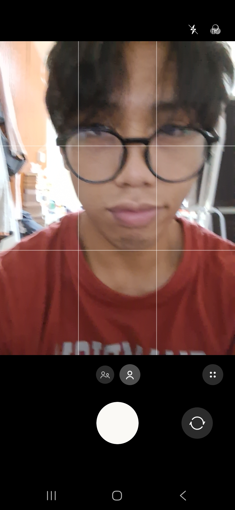
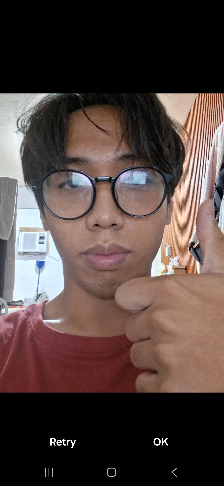
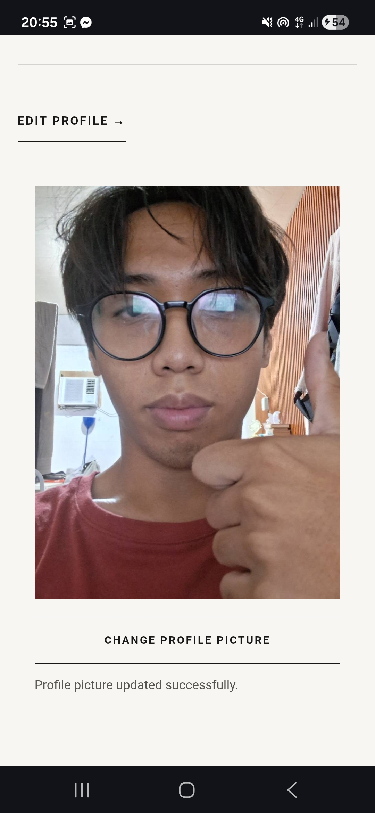
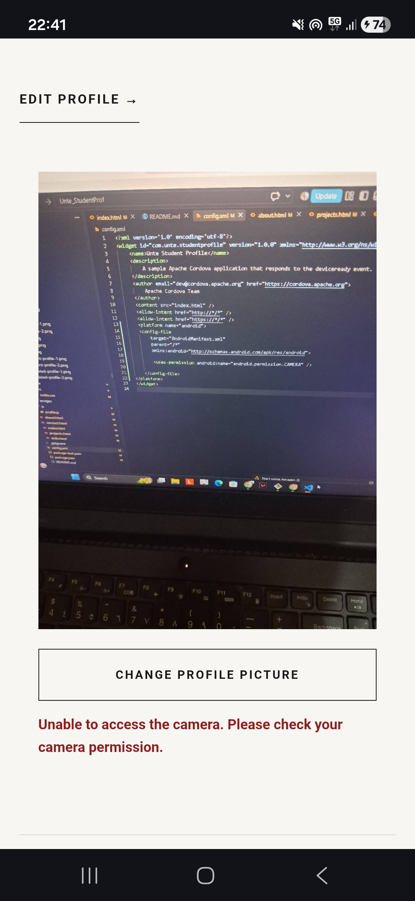

# Unte_StudentProfile

## 1. Project Description

This is my Student Profile application built using HTML, CSS, JavaScript, and Apache Cordova.

The project started as a simple student profile and was gradually expanded into a multi-page application. It currently includes Profile, About, Skills, Projects, and Contact pages.

For Activity 5, I added profile editing, form validation, Save and Cancel functions, and `localStorage`.

For Activity 6, I added camera integration so the user can take a new profile picture using the device camera. The captured image can replace the current profile picture and remain saved even after restarting the application.

---

## 2. Application Pages

### Profile

The Profile page is the main page of the application.

It contains:

* Profile Picture
* Full Name
* Course
* Year Level
* About Me
* Skills
* Edit Profile
* Change Profile Picture

The profile information can be updated without manually editing the HTML.

### About

The About page contains my background, education, interests, and goals.

Some information such as the name, course, year level, and About Me section is also loaded from the saved profile data.

### Skills

The Skills page displays the skills saved in the Student Profile.

When the skills are updated through Edit Profile, the Skills page also updates automatically.

### Projects

The Projects page contains some of the projects I have worked on.

Each project includes its title, description, role or contribution, technologies used, and a project link.

### Contact

The Contact page contains my contact information, GitHub profile, university, course, and year level.

---

## 3. Profile Editing

The application includes an Edit Profile function.

The following information can be edited:

* Full Name
* Course
* Year Level
* About Me
* Skills

When the user selects **Save**, JavaScript checks the required fields before saving the information.

The following fields cannot be empty:

* Full Name
* Course
* Year Level
* About Me

If one of these fields is empty, the application displays a validation message and prevents the profile from being saved.

The **Cancel** button closes the editing interface without saving any of the changes.

Saved profile information is stored using `localStorage`.

---

## 4. Camera Integration

Activity 6 adds a **Change Profile Picture** function.

The application uses the Cordova Camera plugin:

```text
cordova-plugin-camera
```

When the user selects **Change Profile Picture**, the application opens the device camera.

The basic process is:

```text
Change Profile Picture
→ Open Camera
→ Capture Photo
→ Return Photo to Application
→ Update Profile Picture
```

The camera is accessed using JavaScript through:

```javascript
navigator.camera.getPicture()
```

The application uses the camera as the image source instead of selecting an existing image from storage.

---

## 5. Device Feature Integration

Apache Cordova allows the JavaScript code in the application to access native device features using plugins.

For the camera feature, the application waits for the Cordova `deviceready` event before using the camera API.

The project uses:

```text
cordova-plugin-camera 8.0.0
cordova-plugin-file 8.1.3
```

The Camera plugin is used to open the native camera and capture a photo.

The File plugin is used to store the captured image in the application's persistent storage.

The project also includes Android camera permission configuration so camera permission can be requested and handled properly.

---

## 6. Image Handling

The camera returns the captured image as a file URI.

The application then uses the Cordova File plugin to copy the captured image into the application's persistent data directory.

The process is:

```text
Capture Photo
→ Receive Image URI
→ Copy Image to Persistent App Storage
→ Save Image URI
→ Display Image as Profile Picture
```

The saved image location is stored together with the profile information using `localStorage`.

Because the image is copied into persistent application storage, the profile picture remains available after closing and reopening the application.

The user can also take another picture at any time. The newly captured image replaces the previously displayed profile picture.

---

## 7. Error Handling

The application handles camera cancellation and camera errors without crashing.

### Camera Cancellation

If the user opens the camera but cancels without taking a photo, the existing profile picture remains unchanged.

The application returns to the Profile page normally.

### Camera Permission Denial

If camera permission is denied, the application displays a message informing the user that camera access is unavailable.

Example:

```text
Unable to access the camera. Please check your camera permission.
```

### Camera and File Errors

If the camera cannot be opened or the captured image cannot be stored, the application displays an error message instead of crashing.

---

## 8. Responsive Design

The application uses CSS Grid, Flexbox, responsive sizing, and media queries.

The layout supports:

* Desktop
* Tablet
* Mobile

The layout automatically adjusts depending on screen size.

Elements such as the profile image, navigation, forms, project cards, skills, and contact information are arranged differently on smaller screens to keep the interface readable and usable.

---

## 9. How to Run

Install the project dependencies:

```bash
npm install
```

Check the installed Cordova plugins:

```bash
cordova plugin ls
```

The project should include:

```text
cordova-plugin-camera 8.0.0
cordova-plugin-file 8.1.3
```

If the plugins are not installed, they can be added using:

```bash
cordova plugin add cordova-plugin-camera@8.0.0
cordova plugin add cordova-plugin-file@8.1.3
```

Prepare the Android project:

```bash
cordova prepare android
```

Check the Cordova requirements:

```bash
cordova requirements
```

Build the application:

```bash
cordova build android
```

To run the application on a connected Android device, enable USB debugging first.

Check if the device is detected:

```bash
adb devices
```

Then run:

```bash
cordova run android --device
```

When the Change Profile Picture feature is used for the first time, Android may request camera permission.

Camera permission must be allowed for normal camera use.

---

## 10. Application Screenshots

### Student Profile



### Change Profile Picture



### Camera



### Captured Image



### Updated Profile Picture



### Camera Error Handling



---

## Developer

**Yassin L. Unte**

Bachelor of Science in Information Technology
Xavier University - Ateneo de Cagayan

Email: [20240031241@my.xu.edu.ph](mailto:20240031241@my.xu.edu.ph)

GitHub: https://github.com/unte-unteyassin
