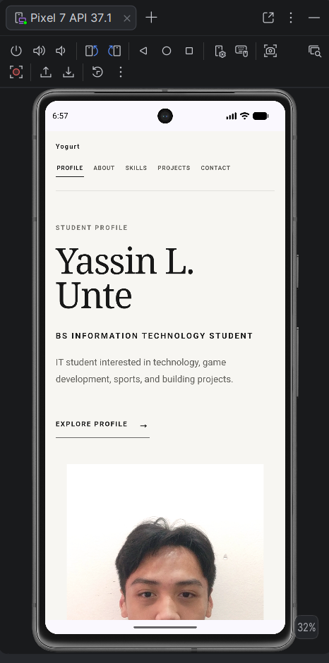
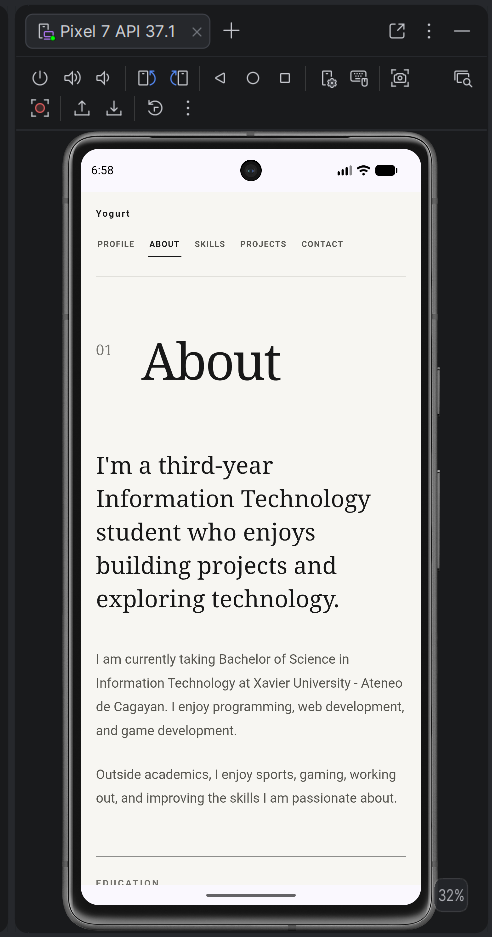
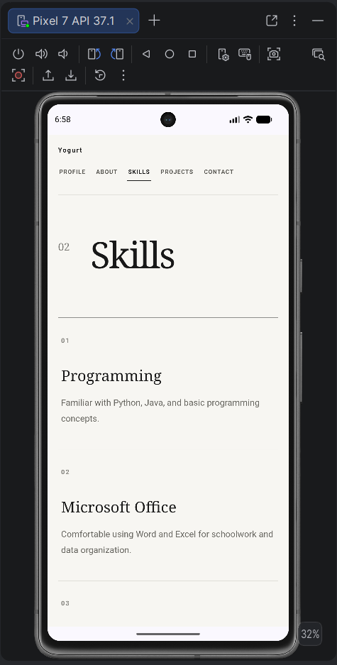
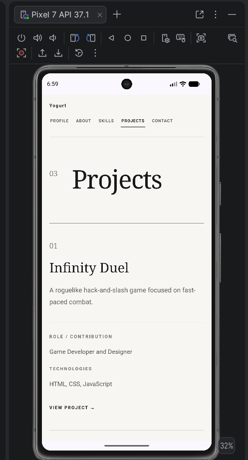
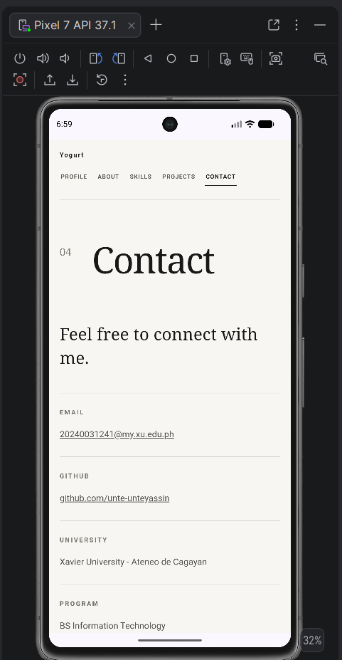

# Unte_StudentProfile

## 1. Project Description

This is my multi-page Student Profile application created using HTML, CSS, and Apache Cordova

The application was extended from my previous responsive Student Profile and now contains separate pages for my profile, background, skills, projects, and contact information

---

## 2. Application Pages

### Profile

The Profile page serves as the homepage of the application

It contains my profile picture, name, short introduction, and links to the other pages

### About

The About page contains information about my background, education, interests, goals, and aspirations

### Skills

The Skills page contains the skills I have developed as an Information Technology student

Each skill includes a short description

### Projects

The Projects page showcases some projects I have worked on

The projects include:

* Infinity Duel
* Palette Lab
* Pixabay Image Search

Each project includes a short description, my role or contribution, technologies used, and a project link

### Contact

The Contact page contains my email address, GitHub profile, university information, and program

It also includes a contact form layout

---

## 3. Navigation

The application uses standard HTML links to navigate between the different pages

The navigation menu provides access to:

* Profile
* About
* Skills
* Projects
* Contact

The same navigation menu is available on every page so users can easily move between sections and return to the homepage

JavaScript is not used for page navigation

---

## 4. Responsive Design

The application uses CSS Grid, Flexbox, responsive units, and media queries to support different screen sizes

The layout is designed to work properly on:

* Desktop
* Tablet
* Mobile

The responsive design helps prevent horizontal scrolling, overlapping elements, distorted images, and cut-off text

---

## 5. UI/UX Principles Applied

### Consistency

All pages use the same color scheme, typography, navigation, spacing, and visual style

### Visual Hierarchy

Large headings, section numbers, spacing, and typography are used to separate important information from supporting content

### Usability

The navigation menu remains available on every page and the current page is visually indicated

### Readability

Text sizes, spacing, and content widths are adjusted to remain readable across different screen sizes

### Accessibility

The application uses meaningful headings, readable color contrast, alternative text for images, clear navigation links, form labels, and visible interactive elements

---

## 6. How to Run

Install the project dependencies:

```bash
npm install
```

Check the Cordova requirements:

```bash
cordova requirements
```

Build the Android project:

```bash
cordova build android
```

Run the application using an Android emulator or connected Android device:

```bash
cordova run android
```

---

## 7. Application Screenshots

### Profile



### About



### Skills



### Projects



### Contact



---

## Developer

**Yassin L. Unte**

Bachelor of Science in Information Technology
Xavier University - Ateneo de Cagayan

Email: [20240031241@my.xu.edu.ph](mailto:20240031241@my.xu.edu.ph)

GitHub: https://github.com/unte-unteyassin
