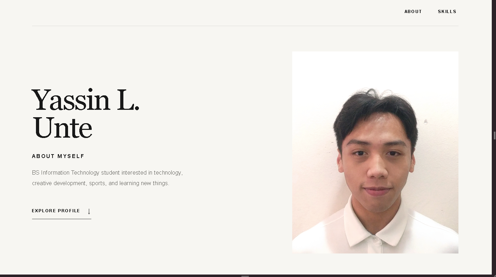
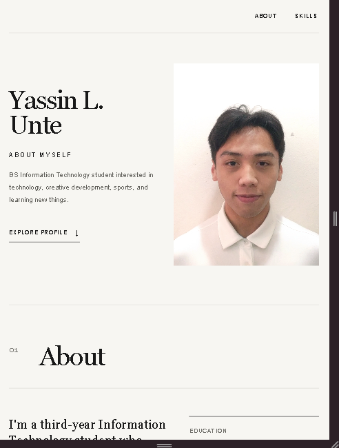
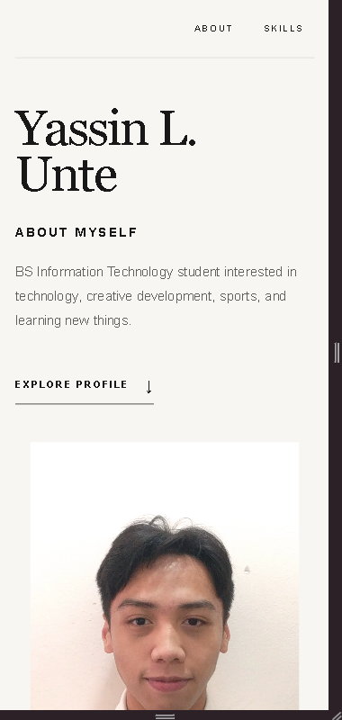

# Unte_StudentProfile

## 1. Project Description
This is my responsive Student Profile made using HTML and CSS. It contains info about myself, my education background, interests, goals/aspirations, and skills. The project was improved from Activity 2 to work better and be responsive on different screen sizes.

## 2. Application Structure
The application contains:
- **Header** - Profile picture, name, About Myself, and navigation.
- **Navigation** - About and Skills links.
- **About** - Personal information, education, interests, and goals.
- **Skills** - Five skills with short descriptions.
- **Footer** - Copyright, name, and year.

## 3. Responsive Design
I used CSS Grid, Flexbox, and media queries to make the layout responsive. The layout and spacing adjust depending on whether it is viewed on desktop, tablet, or mobile.

## 4. UI/UX Principles Applied

- **Responsive Layout** - The content adjusts to different screen sizes.
- **Mobile-Friendly Spacing** - Spacing is reduced and adjusted on smaller screens.
- **Appropriate Typography** - Different font sizes are used for headings and normal text.
- **Clear Visual Hierarchy** - Important headings and information are made more noticeable.
- **Usable Controls** - Navigation links are easy to see and click.
- **Basic Accessibility** - The profile image has alternative text and the text has readable contrast.
- **Consistent Design** - The same colors, fonts, spacing, and style are used throughout the page.

## 5. Navigation
The About and Skills links use HTML anchor links to navigate to their sections on the same page.

## 6. How to Run

Install the dependencies:

```bash
npm install
```

Build the android project:

```bash
cordova build android
```

Run it on an android studio/emulator or connected Android device:

```bash
cordova run android
```

## 7. Application Screenshots

### Desktop


### Tablet


### Mobile


### CORDOVA MOBILE


