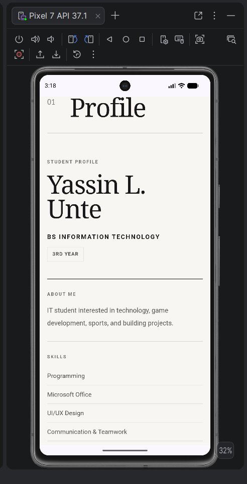
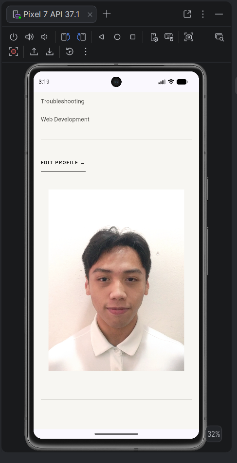
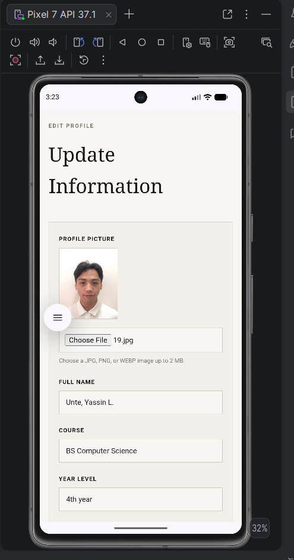
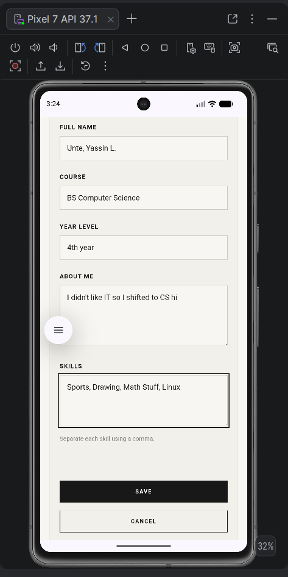
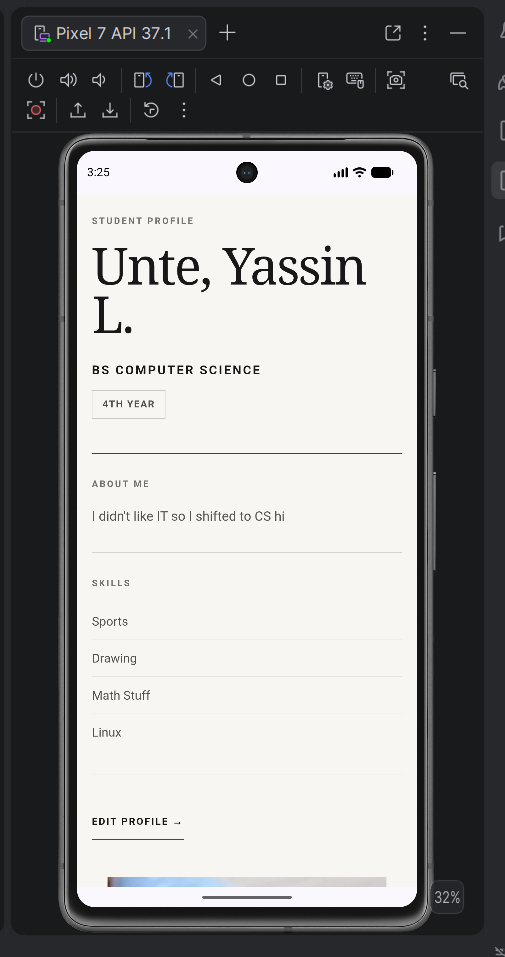
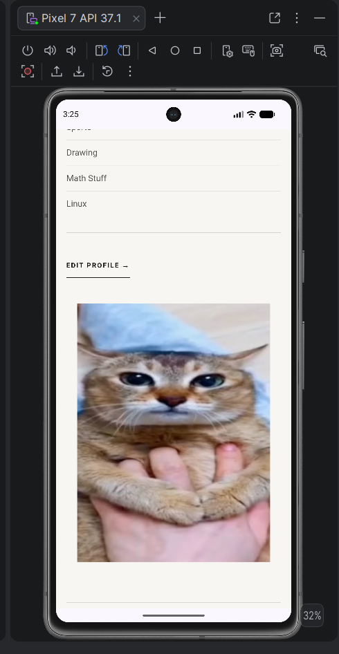
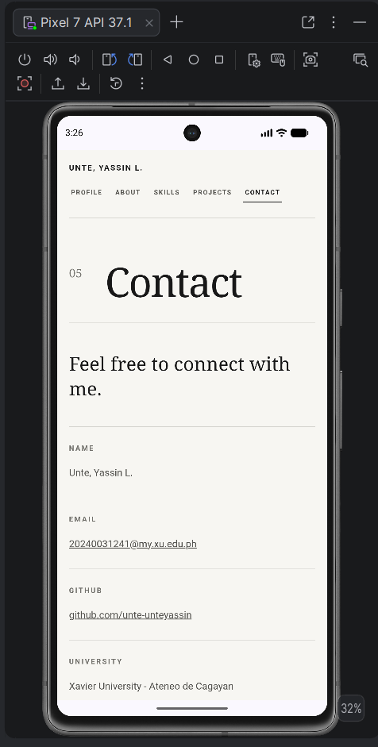
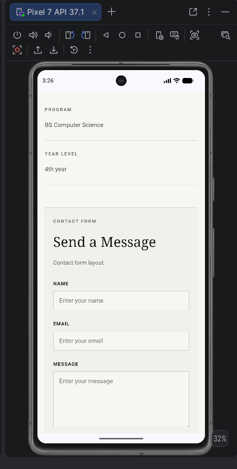
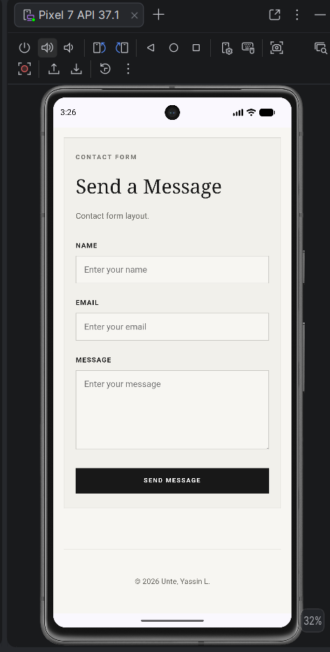

# Unte_StudentProfile

## 1. Project Description

This is my multi-page Student Profile application developed using HTML, CSS, JavaScript, and Apache Cordova.

The application contains separate pages for Profile, About, Skills, Projects, and Contact. Activity 5 adds profile editing, JavaScript validation, dynamic profile updates, and local data storage using `localStorage`.

## 2. Application Pages

### Profile

The Profile page serves as the main page of the application. It displays my profile picture, full name, course, year level, About Me information, skills, and the Edit Profile function.

### About

The About page contains my personal background, educational history, interests, goals, and dynamically displayed profile information.

### Skills

The Skills page displays the skills saved through the Edit Profile interface. The skill cards update automatically based on the latest saved profile information.

### Projects

The Projects page contains projects I have worked on, including their descriptions, roles or contributions, technologies used, and project links.

### Contact

The Contact page contains my contact information, GitHub profile, university, program, and year level.

## 3. Profile Editing

The Profile page contains an Edit Profile function that allows profile information to be modified without manually changing the HTML source code.

The editing interface allows the user to modify:

* Profile Picture
* Full Name
* Course
* Year Level
* About Me
* Skills

Full Name, Course, Year Level, About Me, and Skills are the main required profile fields for Activity 5.

Profile picture editing was added as an additional feature.

Selecting **Save** validates the information, stores the updated profile, updates the displayed content, and closes the editing interface.

Selecting **Cancel** discards unsaved changes and keeps the previously saved profile information.

## 4. JavaScript Functionality

JavaScript is used for:

* Opening and closing the Edit Profile interface
* Handling form input
* Validating required fields
* Saving profile information
* Canceling unsaved changes
* Dynamically updating profile information
* Updating information across multiple application pages
* Updating the Skills page
* Updating and previewing the profile picture
* Retrieving saved information when the application loads

The following fields cannot be empty when saving:

* Full Name
* Course
* Year Level
* About Me

## 5. Local Data Storage

The application uses `localStorage` to store and retrieve profile information.

Stored information includes:

* Full Name
* Course
* Year Level
* About Me
* Skills
* Profile Picture

When no saved profile exists, the application displays default profile information.

When profile information is saved, JavaScript stores the data in `localStorage`. When the application is closed and reopened, the latest saved information is retrieved and displayed automatically.

## 6. Responsive Design

The application uses CSS Grid, Flexbox, responsive sizing, and media queries to support different screen sizes.

The interface is designed for:

* Desktop
* Tablet
* Mobile

The layout adjusts to prevent overlapping content, horizontal scrolling, distorted images, and unreadable text.

## 7. How to Run

Install the project dependencies:

```bash
npm install
```

Check the Cordova requirements:

```bash
cordova requirements
```

Build the Android application:

```bash
cordova build android
```

Run the application using an Android emulator or connected Android device:

```bash
cordova run android
```

## 8. Application Screenshots

### Student Profile





### Edit Profile





### Updated Profile





### Contact







## Developer

**Yassin L. Unte**

Bachelor of Science in Information Technology
Xavier University - Ateneo de Cagayan

Email: [20240031241@my.xu.edu.ph](mailto:20240031241@my.xu.edu.ph)

GitHub: https://github.com/unte-unteyassin
